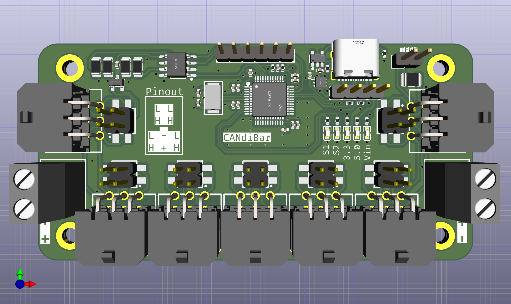
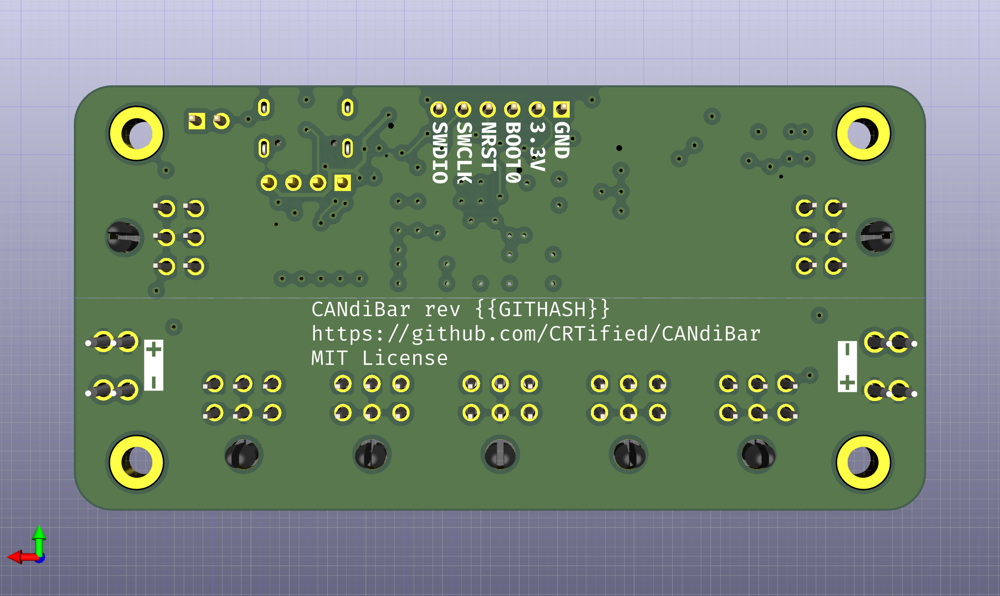
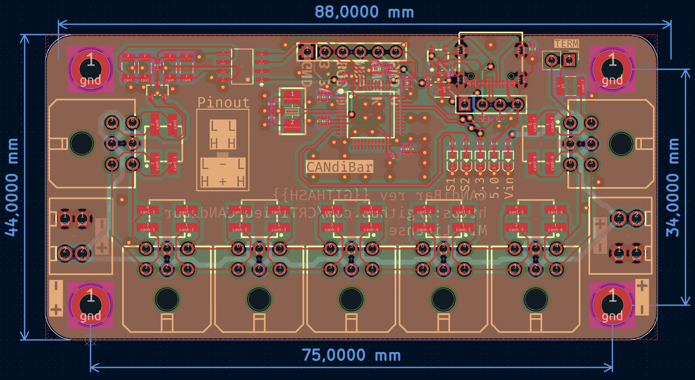

# CANdiBar

## IMPORTANT

This project is heavily WIP. It is not tested, do not assume that it
works and that it fulfills all stated features

## Pictures

## What is this?

This repository aims to contain a small CAN bus and power distribution
board. However, I wanted to avoid making all devices connected by a stub.

Properties:

 - Seven ports for a 2x3P Molex MicroFit 3.0
 - USB2CAN adapter compatible with candlelight
 - Proper CAN setup (No star topology that makes everythin a stub)
 - Pass-through connection configurable by jumper
 - Termination on last slot (might require pass-through on multiple ports)

## Why?

I wanted to try [atopile](https://atopile.io/) and a simple
distribution board seemed like a great fit to test the whole design
process.

I also wanted to have a sane piece of hardware for simplifying the
wiring in my 3D printer, as the
[Voron v0.2r1](https://vorondesign.com/voron0.2) gets pretty crowded
when using more than two MCUs.
